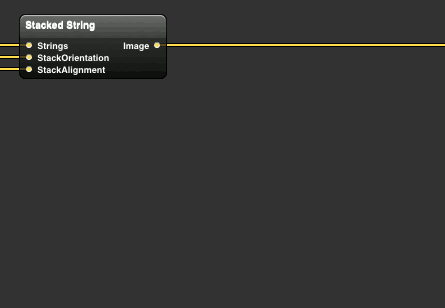

# Stacked String

A macro patch which stacks one or more strings into a image to allow mixing fonts.

## License

* AGPL v3
* Other licensing options may be added in the future.

## Install

Copy StackedString.qtz to `~/Library/Graphics/Quartz Composer Patches`.

## Uninstall

Delete `~/Library/Graphics/Quartz Composer Patches/StackedString.qtz`.

## Input Parameters

* __Strings__
    * An array of structures having font, fontsize, string as their members (see demo above).
* __StackOrientation__
    * Stacking orientation.
    * *Horizontal*: Stack rendered strings from left to right.
    * *Vertical*: Stack rendered strings from bottom to top.
* __StackAlignment__
    * Align rendered strings when they have different width (in vertical stacking) or height (in horizontal stacking).
    * *Left / Bottom*: Strings will be aligned to the left when stacked vertically, to the bottom when stacked horizontally.
    * *Center*: Strings will be centered horizontally (in vertical stacking) or vertically (in horizontal stacking).
    * *Right / Top*: Strings will be aligned to the right when stacked vertically, to the top when stacked horizontally.
